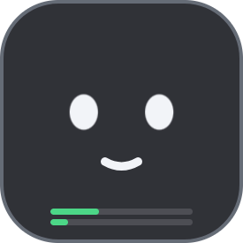
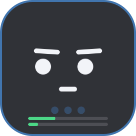
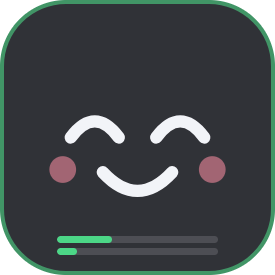
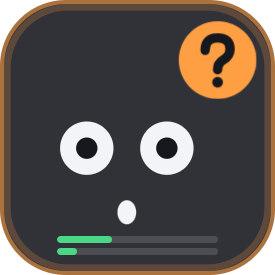
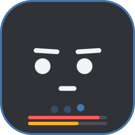

# claude-face

**A little face on your desktop that shows what Claude Code is doing.** Glance at it while you study or work: is Claude working, finished, or waiting for you?

<p>
  
  
  
  
</p>

| Face | Colour | Meaning |
|---|---|---|
| Calm, blinking | grey | Nothing happening |
| Focused eyes, thinking dots | blue | Claude is working |
| Closed-eye smile + chime | green | Claude finished |
| Wide eyes, "?" bubble + chime | orange | Claude is waiting for you (a permission or a question) |

With several Claude Code sessions open, the face shows the most urgent one: asking > working > done > idle.

## Install (Windows)

1. Download `claude-face Setup.exe` from [Releases](../../releases) and run it.
   The installer isn't code-signed, so Windows may say *"Windows protected your PC"*. Click **More info → Run anyway**.
2. On first launch claude-face asks **"Connect claude-face to Claude Code?"** Click **Connect**. This adds hooks to your Claude Code settings (`%USERPROFILE%\.claude\settings.json`); a backup is made first and nothing already in the file is changed.
3. **Restart Claude Code.** Done.

It starts by itself at login, has no taskbar button, and lives in the system tray.

## Using it

- **Move** it by dragging; **resize** it from the bottom-right corner.
- **Click** the face to bring the window of the session that needs you to the front (VS Code, and terminals that show the folder name in their title).
- Hover for two buttons: **mini mode** (a 24px dot) and **–** (hide to tray).
- Right-click the tray icon for every setting.

## Usage meter

 

Two thin bars show how much of your Claude plan is used: **top = 5-hour limit, bottom = weekly limit**. Green under 60%, amber 60–85%, red above 85%. Hover the bars for the exact numbers and the time until each resets. In mini mode, the ring around the dot shows the 5-hour limit.

The numbers are **exact**: the app asks the Claude Code program on your computer for the same figures `/usage` shows. No prompt is sent and no usage is spent. This uses an internal Claude Code request; if a future update changes it, the bars hide themselves rather than show a wrong number.

## Phone features (optional, via ntfy)

Uses [ntfy](https://ntfy.sh), a free push service. Install the **ntfy** app, then tray → **Phone ping: copy topic name**, send that text to your phone, subscribe to it in ntfy, and try tray → **Send test ping**.

- **"Claude needs you"** when the face has been asking for 2 minutes (1, 2 or 5, your choice).
- **"Claude finished"** when a task that ran over 5 minutes is done.
- **Approve from your phone:** when Claude asks permission and you've been away from mouse and keyboard for 45 seconds, the notification comes with **Allow** and **Deny** buttons. It shows the tool and the first 80 characters of the command. Come back to the PC first, and the normal prompt takes over.

The topic name works like a password: anyone who has it can read your pings and answer permission requests. Pings only contain a state, a duration, or (for approvals) that short command preview.

## More features

- **Task queue:** put a `claude-queue.md` in your project with lines like `- [ ] write tests for login`. Each time Claude finishes, it's handed the next unticked task and the line is ticked. Claude Code allows at most 8 hand-offs in a row.
- **Context warning:** a `ctx 86%` badge appears when a session's context is over 80% full, before Claude compacts it. This one is an estimate: the size is read from the session's transcript, and the model's limit is assumed to be 200k tokens until a model has been seen holding more (then 1M).
- **Auto-resume after the usage limit** (off by default, tray to enable): when a session is stopped by your limit, it continues by itself about 90 seconds after the limit resets. It runs without a window and spends usage with nobody watching, which is why it's opt-in.

## How it works

The app runs a small server on `127.0.0.1:7777` (this computer only). Claude Code runs a tiny hook script on these events, and it reports the session's state:

| Claude Code event | Face |
|---|---|
| UserPromptSubmit, PreToolUse | working |
| Stop | done, or the next task from the queue |
| StopFailure | idle (plus the usage-limit ping / auto-resume) |
| Notification | asking (done if it's only the "waiting for your input" reminder) |
| PermissionRequest | asks your phone, only while you're away |
| SessionEnd | session removed |

The hook gives up after 1 second and stays silent if the app isn't running, so it can't slow Claude Code down. "done" turns into "idle" after 5 minutes; a session that sends nothing for 30 minutes is dropped.

## Disconnect or uninstall

- Tray → **Disconnect from Claude Code** removes only the claude-face hooks. Or restore the backup: `%USERPROFILE%\.claude\settings.json.before-claude-face-<date>`.
- Then Settings → Apps → Installed apps → claude-face → Uninstall. Settings live in `%APPDATA%\claude-face`.

## Build from source

Requires Node.js 20+.

```
npm install
npm start               # run
npm run install-hooks   # or connect from the tray
npm run dist            # build the installer into dist/
```

## Limits

- Windows only. Tested on Windows 11 with Claude Code 2.1.270, mostly through the VS Code extension.
- Usage numbers need a Claude subscription (Pro / Max / Team); with an API key there are no plan limits to show.
- Phone approval was tested end to end with Claude Code in print mode; in the VS Code extension the on-screen prompt may stay hidden while the phone is being asked.

## License

MIT
